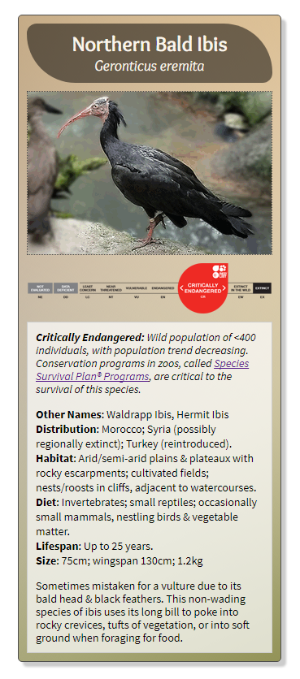

# Animal Trading Card

## Project for Udacity's [Front-End Web Developer Nanodegree Program](https://www.udacity.com/course/front-end-web-developer-nanodegree--nd001)

:link: [View Live Project](https://psittacine.github.io/animal-trading-card/)

**Instructions:**  Recreate the design prototype into a functional web page using HTML & CSS, implementing the required criteria specified in the project rubrics.

### Design Prototype:

### Project Screenshot:

*Photos of Waldrapp Ibises © Laurette Leadon*
